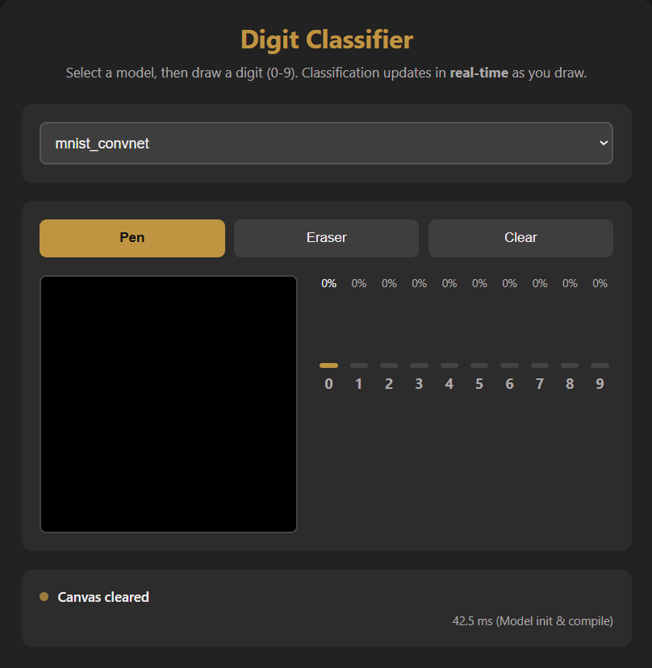

# TinyGrad MNIST Classifier (WebGPU)

## Liens du Projet

* **Démo Live (GitHub Pages) :** **[https://alexlp05.github.io/Mnist-Digit-Reco/](https://alexlp05.github.io/Mnist-Digit-Reco/)**
* **Dépôt (Code Source) :** **[https://github.com/Alexlp05/Mnist-Digit-Reco](https://github.com/Alexlp05/Mnist-Digit-Reco)**

---

## Overview

Ce projet est une application web complète de reconnaissance de chiffres manuscrits, de l'entraînement en Python (avec **tinygrad**) à l'inférence en temps réel dans le navigateur (avec **WebGPU**).

L'utilisateur peut dessiner un chiffre sur un canvas, et un modèle de deep learning (MLP ou CNN) prédit le chiffre en temps réel, affichant la confiance pour chaque classe sous forme de graphique à barres.

## Fonctionnalités

* **Double Modèle :** Sélection facile entre un modèle MLP (rapide) et un CNN (plus précis).
* **Canvas Interactif :** Outils fonctionnels de **Stylo**, **Gomme** et **Effacer**.
* **Pré-traitement Robuste :** Le chiffre dessiné est automatiquement centré et redimensionné pour une précision maximale avant l'inférence.
* **Prédiction en Temps Réel :** L'inférence se lance via WebGPU dès que l'utilisateur arrête de dessiner.
* **Visualisation des Probabilités :** Un graphique à barres dynamique affiche la confiance (softmax) du modèle pour les 10 chiffres.
* **Responsive Design :** L'application est entièrement utilisable sur ordinateur et mobile.

## Résumé des Modèles

Les deux modèles ont été entraînés avec succès pour atteindre ou dépasser les objectifs de précision fixés, en utilisant un processus documenté d'exploration des hyperparamètres.

| Modèle | Architecture Simplifiée | Précision Finale | Objectif |
| :--- | :--- | :--- | :--- |
| **MLP** | `784-512-512-10` | **98.41%** | $\ge 95\%$ |
| **CNN** | `C(32)-C(32)-P-C(64)-C(64)-P-L(10)` | **98.17%** | $\ge 98\%$ |

## Journal d'Expérimentation

Pour une analyse détaillée des différents hyperparamètres testés (LR, Batch Size, Augmentation, etc.) pour les deux modèles :

**[Consulter le fichier HYPERPARAMETERS.md](./HYPERPARAMETERS.md)**