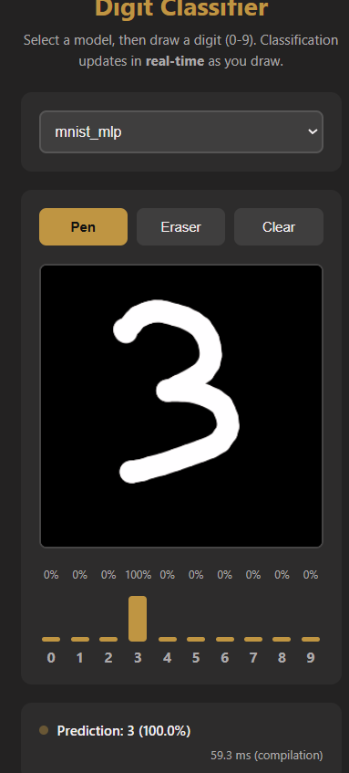

# 🚀 TinyGrad MNIST Classifier (WebGPU)

 

## 🔗 Lien vers la Démo Live

**Accédez à l'application en direct ici : [https://github.com/Alexlp05/Mnist-Digit-Reco/](https://github.com/Alexlp05/Mnist-Digit-Reco/)**

---

## Overview

Ce projet est une application web complète de reconnaissance de chiffres manuscrits, de l'entraînement en Python (avec **tinygrad**) à l'inférence en temps réel dans le navigateur (avec **WebGPU**).

## ✨ Fonctionnalités

* **Double Modèle :** Sélection facile entre un modèle MLP et un CNN.
* **Canvas Interactif :** Outils fonctionnels de **Stylo**, **Gomme** et **Effacer**.
* **Pré-traitement Robuste :** Le chiffre dessiné est automatiquement centré et redimensionné pour une précision maximale.
* **Prédiction en Temps Réel :** L'inférence se lance via WebGPU dès que l'utilisateur arrête de dessiner.
* **Visualisation des Probabilités :** Un graphique à barres dynamique affiche la confiance du modèle pour les 10 chiffres.
* **Responsive Design :** L'application est utilisable sur ordinateur et mobile.

## 🤖 Résumé des Modèles

| Modèle | Précision Finale | Objectif |
| :--- | :--- | :--- |
| **MLP** | **XX.XX%** | $\ge 95\%$ |
| **CNN** | **XX.XX%** | $\ge 98\%$ |

## 🧪 Journal d'Expérimentation

Pour une analyse détaillée des différents hyperparamètres testés :

➡️ **[Consulter le fichier HYPERPARAMETERS.md](./HYPERPARAMETERS.md)**

---

## 💻 Lancement Local

1.  Clonez le dépôt.
2.  Activez l'environnement virtuel (`.\.venv\Scripts\Activate.ps1`).
3.  Installez les dépendances (`pip install tinygrad matplotlib dawn-python`).
4.  Générez les modèles (ex: `STEPS=300 JIT=1 python mnist_mlp.py`).
5.  Lancez le serveur local : `python -m http.server`.
6.  Ouvrez `http://localhost:8000`.